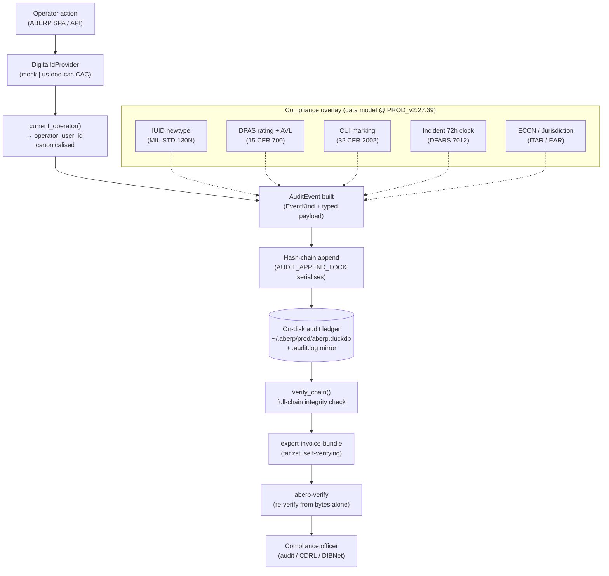

# ABERP Defense-Grade Workflow Walkthrough

**Date:** 2026-06-12 · **Release:** `PROD_v2.27.39` · **Carries:** S358–S367
(IUID Construct 1/2, AVL DPAS rating, CUI Specified `SP-` markings, DFARS
72-hour incident clock, ECCN validation, CAC digital identity, 103 EventKinds
+ `ALL_KINDS_COUNT` drift tripwire).

Operator- and compliance-officer-facing. Every step is labelled **WHERE** it
happens (ABERP SPA / API / DB CLI / SSH / GitHub / Compliance-officer report).
Where an operator action has a one-line "what you actually do" instruction it is
called out as **Operator:**.

> **READ THIS FIRST — what is wired and what is not.**
> At `PROD_v2.27.39` the defense data model (IUID, DPAS, CUI, incident, export
> control, CAC identity) is **built, typed, validated, and gated**, but **no
> production firing site emits any of the 16 defense audit events yet**. The
> types exist; the audit `EventKind`s exist and are exhaustively covered by both
> NAV-leakage gates; the validation gates reject malformed input. What does not
> exist yet is the operator UI that *captures* an IUID / DPAS rating / CUI
> marking / incident and *writes* the corresponding audit row. Section 11 is the
> honest "not yet built" list. Do not tell a customer a defense event is being
> recorded today — it is not. The foundation is laid so the firing sites land
> without re-litigating the data model.

---

## Table of contents

1. [What it does](#1-what-it-does)
2. [System map](#2-system-map)
3. [Audit event families](#3-audit-event-families)
4. [IUID marking (MIL-STD-130N)](#4-iuid-marking-mil-std-130n)
5. [AVL + DPAS rating](#5-avl--dpas-rating)
6. [CUI marking (32 CFR Part 2002)](#6-cui-marking-32-cfr-part-2002)
7. [Incident reporting (DFARS 252.204-7012)](#7-incident-reporting-dfars-252204-7012)
8. [Export control (ITAR / EAR)](#8-export-control-itar--ear)
9. [CAC digital identity](#9-cac-digital-identity)
10. [DR + chain integrity](#10-dr--chain-integrity)
11. [What's not yet built](#11-whats-not-yet-built)
12. [Cross-links](#12-cross-links)

---

## 1. What it does

ABERP's defense posture rests on one structural fact: **every customer-impacting
operator action emits a hash-chained audit event**, and the defense pivot adds
the *vocabulary* a DoD prime cares about on top of that ledger. Concretely, at
`PROD_v2.27.39`:

- **Tamper-evident ledger.** Each audit entry is hash-chained to its predecessor
  (ADR-0008). A single in-process `AUDIT_APPEND_LOCK` serialises appends; the
  hash chain detects any out-of-band insertion, deletion, or reordering. The
  chain is the Part-11 / DFARS-grade moat (see the S330 gap analysis).
- **MIL-STD-130N IUID** lives in the data model as a validated newtype: a part's
  Item Unique Identifier cannot exist in an invalid state once constructed
  (`crates/aberp-compliance/src/uid/mod.rs`).
- **DPAS priority + AVL** are modelled as `DO`/`DX` × a 15 CFR 700 Schedule I
  program symbol, attached to a supplier's Approved-Vendor-List entry
  (`crates/aberp-compliance/src/avl/mod.rs`).
- **CUI marking** renders the exact DoD banner — including the `SP-` Specified
  prefix and limited-dissemination segments — from typed values, so a free-text
  banner can never reach a deliverable
  (`crates/aberp-compliance/src/cui/mod.rs`).
- **Cyber incidents auto-compute the DFARS 72-hour reporting deadline** the
  moment a detection is stamped, when CDI **or** operationally-critical support
  is affected (`crates/aberp-compliance/src/incident/mod.rs`).
- **Operator identity is provider-abstracted.** The `DigitalIdProvider` trait
  (S344) lets a real US-DoD-CAC backend slot in behind the same interface that
  the dev/test mock uses today; the `UsDodCacProvider` stub (S363) proves the
  abstraction holds for a card-session, cert-chain-verified persona — not just
  the HMAC mock (`crates/aberp-digital-id/`).
- **`ALL_KINDS_COUNT` prevents silent enum drift.** Adding an audit `EventKind`
  changes a `const` that two compile-time assertions pin at exactly `103`,
  forcing a deliberate re-review of the NAV-leakage gate (ADR-0081).
- **Everything is mockable.** Export-control classification, digital identity,
  and (later) incident detection all sit behind `Send + Sync` traits so a unit
  test injects a deterministic stub and a real backend swaps in at the boot
  boundary.

---

## 2. System map

**WHERE:** conceptual — how an operator action becomes a verifiable,
exportable compliance record.



The dotted edges mark the overlay that is **typed and validated but not yet
wired to a firing site** — the data flows into an `AuditEvent` only once the
capture UI lands (Section 11).

---

## 3. Audit event families

**WHERE:** `crates/audit-ledger/src/entry/event_kind.rs`.

Every audit event's stable wire name is `<family>.<verb>` (e.g.
`part.uid_marked`). At `PROD_v2.27.39` there are **103 `EventKind` variants**
across **13 prefix families**. The defense pivot added the last 7 families
(personnel through incident) and 16 of the variants.

| Family | Purpose | Defense? | Firing site in prod? |
|--------|---------|----------|----------------------|
| `invoice.*` | NAV e-invoice lifecycle (draft → submit → ack → storno) | no | yes |
| `quote.*` | Auto-quoting + pricing pipeline + email outbox + PDF re-render | no | yes |
| `system.*` | Boot, upgrade, daemon shutdown, restore, catalogue push | no | yes |
| `mes.*` | Work orders, routing ops, QA inspections, dispatch | no | yes |
| `inventory.*` | Stock movements, reservations, commit/consume/release | no | yes |
| `email.*` | Email relay queue/sent/failed | no | yes |
| `personnel.*` | Operator id register, e-signature, access grant/deny | **yes** | **no (S356+)** |
| `material.*` | Material cert attach, heat/lot assignment | **yes** | **no** |
| `part.*` | Serial assignment, IUID marking | **yes** | **no** |
| `export.*` | Export classification set, access check, shipment logged | **yes** | **no** |
| `cui.*` | CUI marking applied, CUI access event | **yes** | **no** |
| `supplier.*` | DPAS priority set, export-screening result | **yes** | **no** |
| `incident.*` | Cyber-incident detected (starts DFARS 72h clock) | **yes** | **no** |

### The 16 defense `EventKind`s

| `EventKind` | Wire name | Semantics |
|-------------|-----------|-----------|
| `PersonnelIdRegistered` | `personnel.id_registered` | An operator digital identity was registered |
| `PersonnelSignatureApplied` | `personnel.signature_applied` | An e-signature was applied to a record |
| `PersonnelAccessGranted` | `personnel.access_granted` | Access to a controlled resource was granted |
| `PersonnelAccessDenied` | `personnel.access_denied` | Access was denied |
| `MaterialCertAttached` | `material.cert_attached` | A material certificate was attached (RECORD) |
| `MaterialHeatLotAssigned` | `material.heat_lot_assigned` | Heat/lot id assigned to a material (STATE TRANSITION) |
| `PartSerialAssigned` | `part.serial_assigned` | A serial number was assigned to a part instance (RECORD) |
| `PartUidMarked` | `part.uid_marked` | An IUID was marked on a part (STATE TRANSITION) |
| `ExportClassificationSet` | `export.classification_set` | An export classification + jurisdiction was set (RECORD) |
| `ExportAccessCheck` | `export.access_check` | An export-controlled artifact access was adjudicated (DECISION) |
| `ExportShipmentLogged` | `export.shipment_logged` | An export shipment was logged (PHYSICAL EXPORT) |
| `CuiMarkingApplied` | `cui.marking_applied` | A CUI marking was applied to a record (RECORD) |
| `CuiAccessEvent` | `cui.access_event` | A CUI artifact access was adjudicated (DECISION) |
| `SupplierDpasPrioritySet` | `supplier.dpas_priority_set` | A DPAS rating was set on a supplier (RECORD) |
| `SupplierExportScreened` | `supplier.export_screened` | A supplier was screened against denied-party lists (DECISION) |
| `IncidentCyberDetected` | `incident.cyber_detected` | A cyber incident was detected (starts DFARS 72h clock) |

### The drift tripwire

**WHERE:** `crates/audit-ledger/src/entry/event_kind.rs` +
`crates/aberp-verify/src/verify.rs` + `apps/aberp/src/export_invoice_bundle.rs`.

`EventKind::ALL_KINDS` is a hand-maintained list of every variant; its length is
exposed as `pub const ALL_KINDS_COUNT: usize`. Two compile-time assertions pin
that count at `103`:

```rust
// crates/aberp-verify/src/verify.rs:1078
const _: () = {
    assert!(
        EventKind::ALL_KINDS_COUNT == 103,
        // ... re-review the NAV-leakage gate for the new variant (ADR-0081)
    );
};
```

```rust
// apps/aberp/src/export_invoice_bundle.rs:949
const _: () = {
    assert!(EventKind::ALL_KINDS_COUNT == 103, /* ... */);
};
```

Adding a 104th variant fails to compile until a contributor updates **both**
assertions — which forces a re-review of whether the new event is allowed to
appear in an exported NAV-XML bundle. This is the mechanism that makes "we added
an event and forgot the leakage gate" impossible to ship silently.

**Compliance-officer note:** the audit vocabulary is closed and version-pinned.
If a bundle contains an event whose name you do not recognise, the count would
have changed — ask which release introduced it.

---

## 4. IUID marking (MIL-STD-130N)

**WHERE:** `crates/aberp-compliance/src/uid/mod.rs`.

MIL-STD-130N requires serially-managed items to carry a globally-unique,
machine-readable **Item Unique Identifier (UII / UID)**. The UII is built from a
small set of data elements and rendered as a concatenated reference string. The
standard defines **two valid constructs**:

| Construct | Elements | Serial unique within | Pick when |
|-----------|----------|----------------------|-----------|
| **Construct 1** | IAC + EID + Serial | the **enterprise** (across all its items) | your enterprise guarantees serial uniqueness across everything it produces |
| **Construct 2** | IAC + EID + Original Part Number + Serial | the **part number** | your serial is unique only within a given part number |

> **S366 review F5 note:** S358 originally defined the two constructs in
> reverse. S367 corrected it. At `PROD_v2.27.39` the code matches the standard:
> `IuidConstruct1` is the serial-only form, `IuidConstruct2` adds the original
> part number. No ledger rows were affected because no firing site exists yet.

### Types

```rust
pub struct IuidConstruct1 { /* iac, eid, serial (all private) */ }
pub struct IuidConstruct2 { /* iac, eid, original_part_number, serial (private) */ }

pub enum Iuid {
    Construct1(IuidConstruct1),
    Construct2(IuidConstruct2),
}
```

The inner fields are **private** — the only way to build one is through `new()`,
which validates every component. A value of these types cannot exist in an
invalid state.

### What `validate_iac` accepts

The Issuing Agency Code (ISO/IEC 15459) names the registration authority. The
gate checks **format only** (registry-membership is an external question):

- non-empty;
- ≤ `MAX_IAC_LEN` = **2 characters**;
- uppercase ASCII alphanumeric (`A-Z`, `0-9`) only.

The other fields (`eid`, `original_part_number`, `serial`) go through the shared
`validate_field`: non-empty, ≤ `MAX_UID_FIELD_LEN` = **50 characters**,
`[A-Za-z0-9-]` only (no whitespace, underscores, or symbols — same set as the
S345 lot/heat ids).

### Rendering

```rust
// Construct 1: IAC + EID + Serial
Iuid::Construct1(c).to_iri()   // e.g. "D" + "CAGE1" + "SN0001" = "DCAGE1SN0001"
// Construct 2: IAC + EID + Original Part Number + Serial
Iuid::Construct2(c).to_iri()   // IAC + EID + PartNo + Serial concatenated

// Audit discriminator carried in the part.uid_marked payload (ADR-0075):
Iuid::Construct1(_).construct_code()  // "construct_1"
Iuid::Construct2(_).construct_code()  // "construct_2"
```

**Operator (future, once the capture UI lands):** "Pick Construct 1 if every
serial you stamp is unique across your whole shop. Pick Construct 2 if you reuse
serial 0001 on different part numbers. If unsure, ask the program's IUID plan —
it tells you which."

> **Known gap (S366 F6):** the per-field cap is 50 chars but MIL-STD-130N caps
> the *concatenated* UII at 50. A "valid" construct can today render a >50-char
> IRI. Fix the aggregate cap before the firing site lands.

---

## 5. AVL + DPAS rating

**WHERE:** `crates/aberp-compliance/src/avl/mod.rs`.

Aerospace / defense procurement constrains *who you may buy from* (AS9100D §8.4
supplier control) and *which orders take priority* (DPAS, 15 CFR 700). The AVL
overlay attaches qualification + DPAS rating + export-screening status to a
partner.

### DPAS priority + rating

A DPAS rating is a **rating symbol** (`DO` or `DX`) joined to a **program
identification symbol** from 15 CFR 700 Schedule I by a hyphen: `DO-A1`,
`DX-A7`.

```rust
pub enum DpasPriority { Do, Dx }   // Dx outranks Do; both outrank an unrated order

pub struct DpasRating {
    pub priority: DpasPriority,
    pub program_symbol: String,    // validated [A-F][1-9], e.g. "A1"
}
```

| Symbol | Meaning |
|--------|---------|
| `DO` | The lower of the two defense priorities |
| `DX` | The higher defense priority; takes precedence over `DO` |
| (no rating) | Unrated commercial order — represented by `Option::None`, never a variant |

The **program symbol** is validated against the 15 CFR 700 Schedule I shape:
exactly two characters, a letter `A-F` then a digit `1-9` (`A1` aircraft, `A7`
radar/electronics, …). Build and parse always validate:

```rust
DpasRating::new(DpasPriority::Do, "A1")?.as_str()   // "DO-A1"
DpasRating::parse("DX-A7")?                          // Ok(DpasRating { Dx, "A7" })
DpasRating::parse("DO-Z9")                           // Err(BadSymbol("Z9"))
DpasRating::parse("D-A1")                            // Err(BadPriority("D"))
```

> **S366 review F13 note:** the prior closed `{None, DoC1, DxC1}` enum could not
> represent `DO-A1` — 15 CFR 700's own worked example. S367 remodelled it as
> rating-symbol × program-symbol. The fields are `pub` for ergonomics, but write
> boundaries must route through `new`/`parse` so a malformed symbol never reaches
> the `dpas_rating` column (S366 F14).

### Export-screening status (stored on the AVL entry)

```rust
pub enum ExportScreeningStatus { NotScreened, Clear, Hit, Inconclusive }  // default: NotScreened
```

| Variant | Storage token | Operationally means |
|---------|---------------|---------------------|
| `NotScreened` | `not_screened` | No screening has run yet — **do not assume clear** |
| `Clear` | `clear` | No denied-party match — OK to transact |
| `Hit` | `hit` | Matched a denied party (BIS Entity List / OFAC SDN) — **must not transact until adjudicated** |
| `Inconclusive` | `inconclusive` | Partial / common-name match — needs manual review before transacting |

`from_storage_str` **fails loud** on any unknown string. A silent fallback to
`Clear` would be the worst-class export-control bug (it would mark an unscreened
or hit supplier as clear to transact), so it errors instead.

> **Distinction:** `ExportScreeningStatus` is the *stored status on the AVL
> entry*. The typed *adjudication of a single screening call* is
> `export_control::ScreeningResult` (Clear / Restricted / Denied) — a different
> axis. S361 dropped the scaffold's `Restricted`/`Denied` AVL variants precisely
> because that adjudication is the other type's job.

### Qualification level

```rust
pub enum QualLevel { Bid, Approved, Disapproved }
```

| Level | `can_bid()` | `can_deliver()` |
|-------|-------------|-----------------|
| `Bid` | ✅ | ❌ |
| `Approved` | ✅ | ✅ |
| `Disapproved` | ❌ | ❌ |

Only `Approved` suppliers may deliver. The full AVL entry
(`ApprovedSupplierEntry`) carries `partner_id`, `qualification_level`, optional
`dpas`, `screening`, and `last_audit_at_ms` (the AS9100D §8.4 re-evaluation
cadence; `None` until the first audit).

**Compliance-officer note:** an `ApprovedSupplierEntry` with `dpas: None` is an
unrated commercial supplier, not an error. `screening: NotScreened` means the
screen has not been run — treat it as blocking, not clear.

---

## 6. CUI marking (32 CFR Part 2002)

**WHERE:** `crates/aberp-compliance/src/cui/mod.rs`.

A `CuiMarking` tags a record / drawing / document with its sensitivity so
downstream handling (storage, transmission, banner printing, access control) can
enforce the right safeguards.

```rust
pub enum CuiMarking {
    Unclassified,
    Cui(CuiCategory),     // controlled but unclassified
    Confidential,         // national-security classified
    Secret,
    TopSecret,
}
```

### CUI categories (starter subset of the DoD CUI Registry)

```rust
pub enum CuiCategory { Cti, Prvcy, Expt, Crit, Lei, Ifg, Inf, Isvi, Proc, Prop }
```

| Category | Abbrev | Specified? (`is_specified()`) |
|----------|--------|-------------------------------|
| `Cti` — Controlled Technical Information | `CTI` | ✅ **Specified** (DoDI 5230.24 / DFARS) |
| `Expt` — Export Control | `EXPT` | ✅ **Specified** (ITAR / EAR) |
| `Prvcy` — Privacy | `PRVCY` | Basic |
| `Crit` — Critical Infrastructure | `CRIT` | Basic |
| `Lei` — Law Enforcement | `LEI` | Basic |
| `Ifg` — Intelligence | `IFG` | Basic |
| `Inf` — Info-systems vulnerability (general) | `INF` | Basic |
| `Isvi` — Info-systems vulnerability | `ISVI` | Basic |
| `Proc` — Procurement & Acquisition | `PROC` | Basic |
| `Prop` — Proprietary Business Info | `PROP` | Basic |

A **CUI Specified** category is governed by a law / regulation / government-wide
policy prescribing controls beyond CUI Basic; its banner takes the `SP-`
prefix. At `PROD_v2.27.39` only `Cti` and `Expt` are flagged Specified
(conservative subset — extend as real flowdowns demand).

> **S366 review F10 note:** S360 originally dropped the `SP-` prefix for every
> category, so the one function whose job is "the compliant DoD banner" emitted a
> non-compliant banner for CTI/EXPT. S367 fixed it.

### Banner output

`display_marking()` is the base marking; `to_banner_str(&[DisseminationControl])`
adds the trailing limited-dissemination segment.

| Marking | `display_marking()` | `to_banner_str(&[NoForn])` |
|---------|---------------------|----------------------------|
| `Cui(Cti)` (Specified) | `CUI//SP-CTI` | `CUI//SP-CTI//NOFORN` |
| `Cui(Expt)` (Specified) | `CUI//SP-EXPT` | `CUI//SP-EXPT//NOFORN` |
| `Cui(Prvcy)` (Basic) | `CUI//PRVCY` | `CUI//PRVCY//NOFORN` |
| `Unclassified` | `UNCLASSIFIED` | `UNCLASSIFIED` (no dissem appended) |
| `Secret` | `SECRET` | `SECRET` |

Dissemination controls (`DisseminationControl`): `NoForn` → `NOFORN`, `FedCon` →
`FEDCON`, `NoCon` → `NOCON`, `DlOnly` → `DL ONLY`. Multiple controls join with
`/`: `CuiMarking::Cui(Prvcy).to_banner_str(&[FedCon, NoForn])` →
`CUI//PRVCY//FEDCON/NOFORN`.

The banner is rendered **from typed values**, so a free-text banner can never
reach the `cui.marking_applied` audit payload's `cui_marking_str` field or a
CDRL deliverable's printed banner.

**Operator (future):** "The banner ABERP prints is the banner that goes on the
document. `SP-` means Specified — do not hand-edit it off."

---

## 7. Incident reporting (DFARS 252.204-7012)

**WHERE:** `crates/aberp-compliance/src/incident/mod.rs`.

A defense contractor handling Controlled Defense Information (CDI) must, per
**DFARS 252.204-7012(c)(1)**, report a discovered cyber incident to the DoD
**within 72 hours of discovery** (filed through the DIBNet / SPRS portal). The
`incident.cyber_detected` audit event records the *detection* that starts the
clock.

### The 72-hour deadline function

```rust
pub const DFARS_72H_REPORT_WINDOW_MS: i64 = 72 * 60 * 60 * 1000;  // 259_200_000

pub fn dod_72h_report_due_at_ms(
    detected_at_ms: i64,
    cdi_affected: bool,
    ocs_affected: bool,
) -> Option<i64>
```

The clause triggers a rapid report when a discovered incident affects **(A)**
covered defense information **OR (B)** the contractor's ability to perform
**operationally critical support (OCS)**. The function returns:

- `Some(detected_at_ms + 259_200_000)` — the instant the report is due — when
  **either** `cdi_affected` or `ocs_affected` is `true`;
- `None` — no deadline attaches — when **neither** is true.

> **S366 review F16 note:** S362's helper originally keyed only on
> `cdi_affected`, so an OCS-only incident — half of the clause's trigger — got no
> deadline. S367 widened the trigger to `cdi_affected || ocs_affected`.

The function is **pure arithmetic** — it does not read a wall clock. The caller
supplies the detection stamp; the deadline derives deterministically. This is
the single place the 72-hour window is added, so the deadline is computed one
way everywhere.

### Severity + detection source

```rust
pub enum IncidentSeverity { Informational, Low, Medium, High, Critical }  // default: Informational
pub enum DetectionSource  { Siem, UserReport, VendorNotification, Audit, Other }  // default: Siem
```

Both serialise via `as_str` (`"informational"`, `"siem"`, …) and parse via
`from_storage_str`, which **errors on any unknown string**. The rationale is
load-bearing: a mis-parse of an unrecognised severity to `Informational` would
silently downgrade a reportable incident below the 72-hour threshold — exactly
the failure CLAUDE.md rule 12 ("fail loud") forbids.

### Operator chip on the incident detail view

There is **no incident-entry UI at `PROD_v2.27.39`** — `incident.cyber_detected`
has no firing site, and there is no detail view, no chip, no automated deadline
alert. The SIEM detection backend (`IncidentDetectionProvider` trait + mock),
the SPRS submission, and the deadline alerting are all out of scope until a later
session (mock-first). When the capture UI lands, the deadline chip will read
straight off `dod_72h_report_due_at_ms`.

**Compliance-officer note (today):** the 72-hour clock is **not** automated yet.
If an incident occurs, the DFARS deadline must still be tracked manually. ABERP
gives you the deterministic deadline math, not the alarm.

---

## 8. Export control (ITAR / EAR)

**WHERE:** `crates/aberp-compliance/src/export_control/mod.rs`.

Two distinct compliance questions live here:

1. **Classification — *what is this item?*** An exported part / drawing /
   software carries an EAR ECCN, a USML category (ITAR), or the catch-all EAR99.
   Mis-classification is a felony, so the real answer comes from a licensed
   classification service — **never inferred** by ABERP.
2. **Screening — *who is the party?*** Every consignee / end-user is screened
   against the consolidated denied-party lists (BIS Entity List, OFAC SDN, State
   DDTC). A hit blocks the shipment.

### Classification vs jurisdiction — two axes

```rust
pub enum ExportClassification { ECCN(String), USMLCategory(String), EAR99, NotClassified, Pending }
pub enum Jurisdiction { Itar, Ear, Ear99, NotControlled, Unknown }
```

`ExportClassification` answers *"what is the code?"*; `Jurisdiction` answers
*"which body of law governs it?"*. They are modelled separately on purpose — an
`ExportClassification::ITAR` variant would be a category error (ITAR is the
regime; the USML category is its classification).

| `Jurisdiction` | Storage token | Regime |
|----------------|---------------|--------|
| `Itar` | `ITAR` | International Traffic in Arms Regulations (22 CFR 120–130), USML, State/DDTC |
| `Ear` | `EAR` | Export Administration Regulations (15 CFR 730–774), CCL, Commerce/BIS, carries an ECCN |
| `Ear99` | `EAR99` | Subject to the EAR but **not** on the CCL — catch-all for most commercial items |
| `NotControlled` | `NOT_CONTROLLED` | A *positive* determination of neither ITAR nor EAR (e.g. published / public-domain, EAR §734.7) |
| `Unknown` | `UNKNOWN` | No determination made — the conservative default until a real service answers |

`Jurisdiction::from_storage_str` fails loud on unknown strings; a silent fallback
to `NotControlled` would be a worst-class silent-omission bug.

### `validate_eccn` — the write-boundary gate

```rust
pub fn validate_eccn(s: &str) -> Result<(), EccnError>
```

A CCL ECCN is **five characters**: a CCL category digit `0-9`, a product-group
letter `A-E`, then a three-digit number (`7A994`, `3A001`, `9E991`). `EAR99` is
accepted as the one non-CCL literal. The gate checks **format only** — whether
the code is *current* on the Commerce Control List is the classification
service's job (mis-classification is a felony, never inferred).

```rust
validate_eccn("7A994")   // Ok
validate_eccn("3A001")   // Ok
validate_eccn("EAR99")   // Ok (the one literal)
validate_eccn("7A99")    // Err — too short
validate_eccn("7F994")   // Err — F is outside A–E
validate_eccn("7a994")   // Err — lowercase
validate_eccn("ear99")   // Err — must be exact "EAR99"
validate_eccn("")        // Err
```

> **S366 review F14 note:** S367 added `validate_eccn` as the gate the future
> AVL write boundary routes `partners.eccn` through. No production writer exists
> yet, but when it lands the only path to the column rejects a malformed code at
> the boundary rather than letting it reach the ledger.

### Mock boundary

`MockExportControlProvider` answers `ExportClassification::NotClassified` +
`ScreeningResult::Clear` for everything and is the only implementation today. The
real BIS/OFAC/DDTC backends slot in behind the same `ExportControlProvider`
trait (`name`, `classify`, `screen_party`).

**Operator (future):** "If ABERP says `NOT_CLASSIFIED` it has not been
classified — that is not the same as 'not controlled'. Don't ship until the
classification comes back."

**What the operator does when `validate_eccn` rejects:** the rejection means the
typed code is malformed (wrong shape), not that the item is uncontrolled. Re-key
the ECCN from the classification determination — the five-character CCL code or
the literal `EAR99`. The row is not written until the code is well-formed.

---

## 9. CAC digital identity

**WHERE:** `crates/aberp-digital-id/` (trait in `provider.rs`, CAC stub in
`cac.rs`, wiring in `apps/aberp/src/serve.rs`).

Every audit-emitting operation will eventually carry the *operator's digital
identity* so the ledger attests **who** authorised each action, not merely
**what** changed. Rather than wire a specific vendor into every emit site, ABERP
defines one trait and swaps backends at the boot boundary.

### The trait

```rust
pub trait DigitalIdProvider: Send + Sync {
    fn name(&self) -> &str;
    fn current_operator(&self) -> Result<DigitalId, ProviderError>;
    fn sign(&self, payload: &[u8]) -> Result<Signature, ProviderError>;
    fn verify(&self, payload: &[u8], sig: &Signature) -> Result<bool, ProviderError>;
}

pub enum ProviderError { NoCurrentOperator, SigningUnavailable(String) }
```

`Send + Sync` so a single `Arc<dyn DigitalIdProvider>` lives in `AppState` and is
shared across every handler + daemon.

### `UsDodCacProvider` — the CAC stub (S363)

The CAC stub is the **second** implementation, added to prove the trait abstracts
across a genuinely different persona than the HMAC mock. It models a US DoD
Common Access Card with three deliberately-different semantics:

1. **Signing persona** — a certificate-bound `stub-ecdsa-p256-cac` digest
   (`SHA-256(signer_id ‖ 0x00 ‖ payload)`), **not** a keyed HMAC. The signer id
   (EDIPI) is folded in so the signature is *card-bound*: a different card yields
   a different signature over the same payload.
2. **Session-based `current_operator()`** — the operator comes from an inserted
   card session (`Option<CacSession>`). Eject the card and there is **no current
   operator**: `current_operator()`, `sign()`, and `verify()` all surface
   `ProviderError::NoCurrentOperator`. This is the first real producer of that
   error arm — the always-present mock can never raise it.
3. **Cert-chain-membership verification** — `verify()` first checks the claimed
   signer is present in the reader's trusted chain (a real CAC reader trusts the
   DoD PKI root, not the payload), then recomputes the stub digest. A signature
   whose digest is internally consistent but whose signer is **not in the chain**
   is rejected — a case the mock's pure-MAC verify cannot even express.

```rust
pub const CAC_ALGORITHM: &str    = "stub-ecdsa-p256-cac";
pub const CAC_ISSUER: &str       = "us-dod-cac";
pub const CAC_DEFAULT_EDIPI: &str = "0000000363";  // obviously-fake 10-digit, never a real person

UsDodCacProvider::new()              // insert default stub card
UsDodCacProvider::with_edipi("...")  // insert a specific card (two cards in one reader)
UsDodCacProvider::ejected()          // no card → NoCurrentOperator on every call
```

A CAC operator's `DigitalId` carries clearance scopes (`["operator",
"cui-cleared"]`) a bare mock operator does not — proving `scope` is
provider-shaped, not fixed.

### How `current_operator` is resolved at the session boundary

**WHERE:** `apps/aberp/src/serve.rs` → `build_digital_id_provider()`.

```rust
fn build_digital_id_provider() -> Arc<dyn DigitalIdProvider> {
    let requested = std::env::var("ABERP_DIGITAL_ID_PROVIDER").unwrap_or("mock".into());
    match requested.as_str() {
        "mock"        => Arc::new(MockProvider::new()),
        "us-dod-cac"  => Arc::new(UsDodCacProvider::new()),
        unknown       => { /* WARN; fall back to mock */ Arc::new(MockProvider::new()) }
    }
    // then: provider.current_operator() → one INFO line naming provider + operator
}
```

The provider is constructed **once at boot** and held in `AppState.digital_id`.
The `ABERP_DIGITAL_ID_PROVIDER` env var selects the backend; the default and the
fallback for any unknown value is `mock`.

### What happens if a CAC isn't present

- **Dev / test / default:** the mock provider answers a static operator and signs
  with a hand-rolled HMAC keyed on a *publicly-known* test key. It logs a WARN on
  every construction. It is **not production crypto** — it proves the shape of
  sign/verify, nothing more.
- **`us-dod-cac` selected, card ejected:** `current_operator()` returns
  `NoCurrentOperator`; the boot log carries a WARN that the provider was
  configured but `current_operator()` failed.
- **Both backends WARN on construction** — neither can ship silently as the
  identity behind a production operator.

> **Critical honesty:** at `PROD_v2.27.39` both backends are **non-production
> stubs**. There is no real PKCS#11 CAC driver, no real ECDSA, no real DoD PKI
> chain validation. The `current_operator()` identity is **not yet consumed by
> any audit firing site** — the payload field `operator_user_id` is the canonical
> Bearer-subject anchor (S367 F1), and the provider handle wiring into emit sites
> lands later.

---

## 10. DR + chain integrity

**WHERE:** `crates/audit-ledger/src/` (chain + storage), `aberp-verify` binary,
SSH on the prod host.

The defense value of the whole system collapses if the ledger can be tampered
with undetected. Three mechanisms defend it.

### `verify_chain()` — full-chain integrity

```rust
// crates/audit-ledger/src/storage/mod.rs:229
impl Ledger {
    pub fn verify_chain(&self) -> Result<u64, LedgerVerifyError>
}
// delegates to crates/audit-ledger/src/chain/verify.rs:25
pub fn verify_chain<'a, I>(tenant: &TenantId, entries: I) -> Result<u64, VerifyError>
```

It re-walks every entry from the tenant genesis, recomputing the hash chain, and
returns the count of entries verified (or an error naming the first break). It is
run:

- post-commit on the binary export path (`export-invoice-bundle` aborts loud on
  `Err` per ADR-0029 §6);
- on demand from the bundle verifier (below).

### `AUDIT_APPEND_LOCK` — append serialisation

```rust
// crates/audit-ledger/src/storage/mod.rs:92
static AUDIT_APPEND_LOCK: Mutex<()> = Mutex::new(());
```

A single process-wide mutex serialises every append, so two concurrent writers
cannot interleave and fork the `seq`. The hash chain is the *global* detector;
the lock is the *in-process* preventer. (Per S332/S335: ABERP reopens the DB
connection per write rather than holding a persistent connection, because a
persistent connection across DuckDB `Database` instances was proven to fork the
audit chain — reopen-per-write IS the coherence guarantee.)

### Validating a restored ledger

**WHERE:** SSH on the prod host + the `aberp-verify` CLI.

After any DB restore (snapshot or hand-surgery), re-verify before trusting the
ledger:

```bash
# WHERE: SSH on prod host — full-chain verify of the live ledger
#        (export a single invoice bundle; the export path runs verify_chain first)
/Users/aben/ABERP/target/release/aberp export-invoice-bundle \
  --tenant <tenant> --invoice-id <known-invoice> \
  --db ~/.aberp/prod/aberp.duckdb \
  --out /tmp/verify-probe.tar.zst --allow-overwrite

# WHERE: SSH on prod host — re-verify the bundle from its own bytes alone
#        (no DB, no network, no keychain; exit 0 = all-OK, 1 = FAIL, 2 = structural)
/Users/aben/ABERP/target/release/aberp-verify --bundle /tmp/verify-probe.tar.zst
```

`aberp-verify` re-checks the hash chain, per-entry integrity, payload-vs-NAV-XML
byte equality, the per-`EventKind` root-element pin, bundle membership, and
manifest invariants — entirely from the bundle's bytes. It is the artifact you
hand a compliance officer who must independently attest the ledger was not
altered.

**For the full "ABERP won't boot" recovery flow** — snapshot restore first,
hand-surgery only as last resort, and the compliance-gap memo a hand-surgery
restore requires — see **[`dr-playbook.md`](./dr-playbook.md)** (the playbook
written after INV-0, the 5-hour hand-surgery DB recovery on 2026-06-11).

Paths (from the DR playbook):

| What | Path |
|------|------|
| Live prod DB | `~/.aberp/prod/aberp.duckdb` |
| Live audit log mirror | `~/.aberp/prod/aberp.duckdb.audit.log` |
| Release binary | `/Users/aben/ABERP/target/release/aberp` |
| Prod launcher | `./run/run_prod.sh` |

---

## 11. What's not yet built

Stated plainly, per `[[trust-code-not-operator]]` and CLAUDE.md rule 12. At
`PROD_v2.27.39` the defense foundation is **types + traits + audit vocabulary +
validation gates + NAV-leakage coverage**. The following are **not** built:

- **No firing sites for any of the 16 defense audit events.** `personnel.*`,
  `material.*`, `part.*`, `export.*`, `cui.*`, `supplier.*`, `incident.*` exist
  in the enum, are covered by both NAV gates, and have unit tests — but **nothing
  in production emits them**. There is no capture UI that turns an operator action
  into one of these events.
- **No part-instance table.** IUID models the UII *string* only. There is no
  table of serialised part instances, no Data Matrix mark generation (that is a
  future `aberp-marking` crate), and no aggregate UII length cap (S366 F6).
- **No lot/heat traceability writer.** The `LotId`/`HeatId` newtypes and the
  nullable `current_lot_id`/`current_heat_id` columns exist, but nothing routes a
  write through the newtypes — the "cannot exist in an invalid state" guarantee
  protects zero production rows today (S366 F3).
- **No real CAC driver.** `UsDodCacProvider` is a stub: `stub-ecdsa-p256-cac` is
  a SHA-256 stand-in, not real ECDSA; there is no PKCS#11 hardware-token driver,
  no DoD PKI chain validation. The mock is keyed on a publicly-known test key.
- **No incident UI / SIEM backend / SPRS submission / 72h alerting.** The
  deadline math is deterministic; the alarm, the detail view, and the DIBNet
  filing are not built.
- **No real export-control backend.** `MockExportControlProvider` answers
  `NotClassified` + `Clear` for everything. No BIS/OFAC/DDTC integration.
- **Single-tenant compliance crate.** The compliance types are not multi-tenant
  partitioned beyond the ledger's own `TenantId`.
- **Not yet built (from the broader aerospace pivot, S330 gap analysis):**
  scheduling, Renishaw/Trumpf/furnace/robot MES task integration, BOM revisions,
  NCR/CAPA workflows, full AS9100D process coverage.

The honest summary: **ABERP at `PROD_v2.27.39` can be *made* defense-grade
because the audit ledger is Part-11-grade and the compliance vocabulary is in
place — but the capture-and-emit layer that records defense events in production
is the next body of work, not shipped.**

---

## 12. Cross-links

- **[`dr-playbook.md`](./dr-playbook.md)** — S365 disaster-recovery playbook;
  snapshot-restore-first, hand-surgery last, compliance-gap memo. Linked from
  Section 10.
- **`docs/findings/s366-defense-pivot-adversarial-review.md`** — the S366
  adversarial review (21 findings, 3 🔴) that drove the S367 corrections cited
  throughout this doc: IUID construct swap (F5), DPAS remodel (F13/F14), CUI
  `SP-` prefix (F10), DFARS OCS trigger (F16), `validate_eccn` (F14), operator
  field-name canon (F1).
- **`docs/findings/s330-aerospace-certification-gap-analysis.md`** — the AS9100D
  gap analysis establishing the audit ledger as the Part-11-grade moat and the
  three structural must-builds (identity + e-sig, lot/heat traceability, AVL +
  material certs).
- **ADRs:** ADR-0008 (audit ledger), ADR-0070 (`DigitalIdProvider`), ADR-0071
  (`aberp-compliance` crate), ADR-0073–0079 (the seven defense event families),
  ADR-0080 (`UsDodCacProvider`), ADR-0081 (`ALL_KINDS_COUNT` drift tripwire).
- **Code surfaces:**
  - `crates/aberp-compliance/src/{uid,avl,cui,incident,export_control}/mod.rs`
  - `crates/aberp-digital-id/src/{provider,cac,mock}.rs`
  - `crates/audit-ledger/src/entry/event_kind.rs` (103 kinds + `ALL_KINDS_COUNT`)
  - `crates/audit-ledger/src/{chain/verify.rs,storage/mod.rs}` (chain integrity)
  - `crates/aberp-verify/` (independent bundle verifier)
  - `apps/aberp/src/{serve.rs,export_invoice_bundle.rs}` (boot wiring + export)
