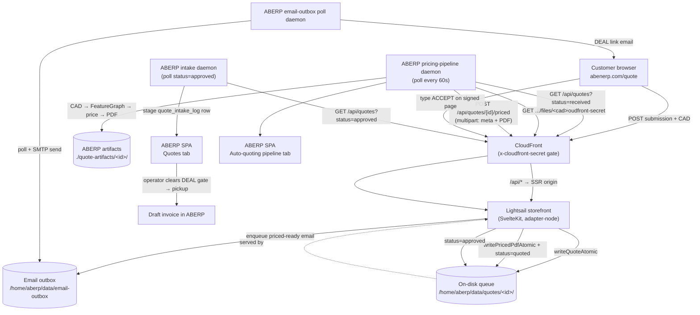

# Walkthrough — storefront → ABERP quote workflow (operator guide)

**Date:** 2026-06-12 (operator-flow refreshed 2026-06-15, S421) · **Release:**
PROD_v2.27.66 · **Audience:** operator

This is the end-to-end operator guide for the auto-quoting workflow: a customer
requests a quote on the storefront, ABERP prices it automatically, the priced
PDF is written back to the storefront, the customer accepts, and the operator
turns the accepted quote into an invoice in ABERP.

Every step is labelled with **WHERE** you do it:

- **AWS Console** — browser, `console.aws.amazon.com`
- **CloudShell** — the AWS web shell
- **SSH** — a shell on the Lightsail box (`ssh aberp@<box>`)
- **Terminal** — your own laptop shell
- **GitHub** — `github.com/Cservin69/ABERP`
- **Browser** — the public storefront, `https://abenerp.com`
- **ABERP SPA** — the ABERP desktop app (the operator UI)
- **Storefront** — the SvelteKit storefront app on Lightsail

Where the code already enforces a safety property, this doc states the property.
It does not tell you to "be careful" — the guard rails are in the code.

---

## Table of contents

1. [What it does](#1-what-it-does)
2. [System map](#2-system-map)
3. [First-time setup — storefront side](#3-first-time-setup--storefront-side)
4. [First-time setup — ABERP side](#4-first-time-setup--aberp-side)
5. [Daily operator flow](#5-daily-operator-flow)
6. [Common stuck states](#6-common-stuck-states)
7. [Diagnostic checklist](#7-diagnostic-checklist)
8. [What's missing](#8-whats-missing-honest)
9. [Cross-links](#9-cross-links)

---

## 1. What it does

A customer fills in the `/quote` form on the public storefront, attaches a CAD
file (`.stl` / `.step` / `.stp`), and submits. The storefront validates the
submission and writes it to the on-disk quote queue at
`/home/aberp/data/quotes/<quote-id>/`. ABERP's pricing-pipeline daemon polls the
storefront (`GET /api/quotes?status=received`) every 60 seconds, downloads the
CAD, extracts a feature graph, prices it with the quote engine, renders a priced
PDF, and POSTs it back to the storefront (`POST /api/quotes/{id}/priced`). The
storefront flips the quote to `quoted` and emails the customer a link with a
signed DEAL token. The customer accepts by typing `ACCEPT` on the signed page;
the storefront flips the quote to `approved`. ABERP's intake daemon picks up the
`approved` quote, stages a draft invoice, and writes the customer-facing status
back to `processing` (S398 — *not* `invoiced`; the draft is pre-DEAL and not a
fiscal invoice). The operator then either clears the **DEAL** gate — converting
the quote into a draft invoice in ABERP — or **Refuses** it with a reason (S403)
if stock/capacity cannot fulfil it.

The operator watches the in-flight pricing on the **Auto-quoting pipeline** tab
(`PricingJobsList.svelte`) and works the accepted quotes on the **Quotes** tab
(`QuotesList.svelte`).

---

## 2. System map



The storefront is the queue (ADR-0009): ABERP only ever **polls outbound** and
**POSTs outbound**. There is no inbound tunnel into ABERP, no third-party relay.

---

## 3. First-time setup — storefront side

The storefront runs on Lightsail under systemd with `ProtectSystem=strict`,
which makes every release directory immutable. Application state therefore lives
**outside** the release dir, under `/home/aberp/data`, which the systemd unit
whitelists via `ReadWritePaths=`.

### 3.1 — [SSH] Environment variables

These live in `/etc/aberp-site.env` (or as systemd `Environment=` lines). The
storefront refuses to serve (returns `503` on every non-`/healthz` request) when
a load-bearing one is missing or wrong — the boot checks in
`src/lib/server/boot-checks.ts` enforce it.

| Variable | Required | Default if unset | Role | Boot check |
|---|---|---|---|---|
| `ABERP_SITE_ADMIN_TOKEN` | **yes** | — (503 from auth) | Bearer token for every `/api/quotes*` call. ABERP must present the same value. | auth → 503 |
| `CLOUDFRONT_SHARED_SECRET` | recommended | check skipped | Value of the `x-cloudfront-secret` header CloudFront attaches; the origin rejects any request missing it with `403`. When unset, the origin gate is skipped entirely. | — |
| `ABERP_SITE_QUOTE_DIR` | **yes (prod)** | `/home/aberp/data/quotes` | The on-disk quote queue. **Must be an absolute path** — `resolveQuoteDir()` throws on a relative path, and F-QUOTE refuses start. | **F-QUOTE** → 503 |
| `ABERP_SITE_CATALOGUE_DIR` | **yes (prod)** | `/home/aberp/data/catalogue` | Material-catalogue snapshot the `/quote` dropdown reads. Must be absolute + writable. | **F-CAT** → 503 |
| `ABERP_SITE_EMAIL_OUTBOX_DIR` | **yes (prod)** | `/home/aberp/data/email-outbox` | Storefront-as-queue email outbox ABERP polls (ADR-0009). Must be absolute + writable. | **F15** → 503 |
| `ABERP_SITE_OPERATOR_EMAIL` | **yes** | — | The inbox CC'd on every customer mail. Without it, submission/priced/accept emails are silently skipped. | **F8** → 503 |
| `BODY_SIZE_LIMIT` | **yes** | — | adapter-node body cap. Must be ≥ 50 MB or every priced-writeback over 512 KB 413s before the handler runs. | **F19** → 503 |
| `ABERP_INTERNAL_BASE_URL` | no | — | **Deprecated** (pre-ADR-0009 push relay). No longer consulted. | — |
| `ABERP_EMAIL_RELAY_TOKEN` | no | — | **Deprecated** (pre-ADR-0009 push relay). No longer consulted. | — |

### 3.2 — [SSH] Create the state directories writable by the storefront user

```bash
sudo install -d -o aberp -g aberp /home/aberp/data/quotes
sudo install -d -o aberp -g aberp /home/aberp/data/catalogue
sudo install -d -o aberp -g aberp /home/aberp/data/email-outbox
```

The boot checks each run a `mkdir -p` + `W_OK` + sentinel-write round-trip
(`probeOutboxDirSync`), so a path that exists but is not writable still trips the
check. You do not need to pre-create the dirs if `ReadWritePaths=/home/aberp/data`
is set — the probe creates them — but the parent must be writable.

### 3.3 — [SSH] Why `ABERP_SITE_QUOTE_DIR` must be absolute (the S356 trap)

A relative path like `./data/quotes` resolves, via `pathResolve`, **inside the
immutable release directory**. The quote dir gets created there, works until the
next deploy, and is then silently discarded when the release dir is swapped —
taking every `metadata.json` with it. The downstream symptom is a
`GET /api/quotes/{id}/priced` that 404s, which ABERP misreads (see §3.4). The
fix shipped in S356/S368: the default is now the absolute
`/home/aberp/data/quotes`, and `resolveQuoteDir()` throws on any relative value.

```bash
# [SSH] verify the live value is absolute
grep ABERP_SITE_QUOTE_DIR /etc/aberp-site.env
# expect: ABERP_SITE_QUOTE_DIR=/home/aberp/data/quotes
```

### 3.4 — [AWS Console] CloudFront `404` response code must stay `404`

CloudFront has a `404 → /index.html` CustomErrorResponse row (it gives typo'd
marketing URLs a friendly homepage). Its **Response code must be `404`, not
`200`**. If it is set to `200`, a genuine storefront `404` from `/api/*` is
rewritten into a `200 text/html` SPA shell. ABERP's writeback classifier then
sees `200 text/html`, cannot parse it as JSON, and labels it
`RoutingMisconfigured` — sending you to the wrong panel while the real fault is a
storefront 404.

Full steps to verify and fix:
**ABERP-site repo → `docs/walkthroughs/cloudfront-error-page-fix.md`**.

### 3.5 — [SSH] Confirm the storefront is up

```bash
curl -s -o /dev/null -w '%{http_code}\n' https://abenerp.com/healthz   # expect 200
```

A `503` on every path other than `/healthz` means a boot check failed; the body
of any non-`/healthz` request names the failing finding (`F8`, `F15`, `F19`,
`F-CAT`, `F-QUOTE`):

```bash
curl -s https://abenerp.com/api/quotes | head -20
# on boot-check failure: "service unavailable: storefront boot checks failed. ... F-QUOTE: ..."
```

---

## 4. First-time setup — ABERP side

ABERP runs the pricing-pipeline daemon in-process. It needs to know the
storefront base URL, the bearer token, and the CloudFront origin secret.

### 4.1 — [ABERP SPA] Storefront base URL + bearer

- **Base URL** lives in ABERP's quote-intake config (TOML), editable from the
  ABERP SPA's quote-intake settings (`PUT /api/quote-intake/config`). It must
  start with `http://` or `https://`. The catalogue-push daemon hot-reloads it;
  **the pricing-pipeline daemon captures it at boot, so a base-URL change for the
  pipeline requires an ABERP restart.**
- **Bearer token** lives in the OS keychain only (never in the TOML, never in
  logs). It **must equal the storefront's `ABERP_SITE_ADMIN_TOKEN`** — a mismatch
  surfaces as `Unauthorized` on the pricing row (§6).

### 4.2 — [SSH / Terminal] CloudFront origin secret

The daemon attaches the `x-cloudfront-secret` header on every call. Its value
comes from, in precedence order:

1. Env override `ABERP_STOREFRONT_ORIGIN_SECRET`
2. OS keychain — service `aberp.storefront.<tenant_id>`, item
   `storefront_origin_secret`

It **must equal the storefront's `CLOUDFRONT_SHARED_SECRET`**. A mismatch
surfaces as `Forbidden` (403) on the pricing row (§6). Operator provisioning
runbook: `docs/runbooks/s339-catalogue-auth-operator-runbook.md`.

### 4.3 — [SSH] ABERP-side env knobs

| Variable | Default | Role |
|---|---|---|
| `ABERP_STOREFRONT_ORIGIN_SECRET` | keychain | `x-cloudfront-secret` header value (env beats keychain). |
| `ABERP_QUOTE_PIPELINE_ARTIFACT_DIR` | `./quote-artifacts` | Local dir where `<id>/{cad, priced.pdf}` land. |

### 4.4 — Daemon cadence and retry semantics (code-enforced)

- **Poll interval:** 60 seconds (`PIPELINE_POLL_SECS = 60`).
- **Boot delay:** the daemon sleeps 30 seconds after start before its first
  cycle (lets other daemons settle).
- **Batch cap:** at most **5 jobs advance one step per cycle**
  (`MAX_JOBS_PER_CYCLE = 5`) — one state transition per row per cycle.
- **State machine:** `Fetched → Extracting → Pricing → Rendering → PostingBack →
  Posted | Failed`.
- **Error backoff:** on a cycle-level error the daemon backs off `5s → 15s → 60s
  → cadence`, then resets on the next clean cycle.
- **`classify_response_gate`:** before any JSON parse, every storefront response
  is gated on HTTP status + `Content-Type`. Only a `2xx` + `application/json`
  body is parsed; `401`/`403` are auth verdicts; a `200 text/html` is
  `RoutingMisconfigured`; everything else is a typed transport-vs-app verdict
  (§6). This gate is shared by the list-poll and the priced-writeback.
- **`resolved_writeback_url`:** the daemon trims a trailing `/` off the stored
  base URL before composing `/api/quotes/{id}/{suffix}`, so a base URL typed as
  `https://abenerp.com/` cannot produce a `//api/...` double-slash that
  CloudFront's `/api/*` behavior would miss (the S351 fix).
- **Retry vs Failed:** the daemon **never auto-retries a `Failed` row**.
  `next_actionable_job` only returns rows in `fetched/extracting/pricing/
  rendering/posting_back`. A `Failed` row is re-enqueued **only** by the
  operator's Retry click (§5), which bumps `attempt_n`. `Transient`-classified
  failures (5xx / timeout / transport) are retryable on the operator's click;
  `Permanent` ones (routing / auth / contract) need an operator fix first.

---

## 5. Daily operator flow

### 5.1 — [Browser] Customer submits a quote

Customer goes to `https://abenerp.com/quote`, fills the form, attaches a CAD
file, and submits. The storefront writes
`/home/aberp/data/quotes/<id>/metadata.json` with `status: "received"`.

### 5.2 — [ABERP SPA] Open the Auto-quoting pipeline tab

Open ABERP → **Quoting** → **Auto-quoting pipeline** (`Auto-árazás folyamatban`).
Click **Frissítés / Refresh** to load. Within ~90 seconds (30s boot delay + one
60s poll on a cold daemon; ~60s warm) a new row appears.

The row shows: **Ref** (short quote id), **Customer**, **Material**, **Qty**,
**State** chip, **Price (EUR)**, **Error**, **Updated**.

State chips, in order:

| Chip | Meaning |
|---|---|
| `Beérkezett / Fetched` | CAD downloaded, queued |
| `CAD-elemzés / Extracting` | feature graph being extracted |
| `Árazás / Pricing` | quote engine running |
| `PDF / Rendering` | priced PDF being rendered |
| `Visszaküldés / Posting back` | POSTing priced PDF to storefront |
| `Elküldve / Posted` | priced + delivered to storefront |
| `Sikertelen / Failed` | stopped — see Error column + §6 |

The row advances one chip per ~60s cycle. No operator action is needed for a
healthy row to reach `Posted`.

### 5.3 — [ABERP SPA] Inspect a row

Click any row (or focus it and press Enter) to open the detail panel
(`PricingJobDetail.svelte`). It shows the customer, material, the pricing
breakdown, the extracted FeatureGraph, the writeback timeline (derived from the
audit ledger), and the operator actions:

- **Megnyitás / Letöltés (Open / Download PDF)** — view or download the priced
  PDF (`GET /api/quote-pricing-jobs/:id/pdf`). Shown once the PDF is rendered.
- **✎ material edit** — override the material grade
  (`PATCH /api/quote-pricing-jobs/:id`). Catalogue-validated; on save the row
  resets to `Fetched` and re-prices. Records `quote.material_grade_edited`.

There is **no operator Accept-on-behalf** action on this panel. Acceptance is
customer-driven: the customer accepts from the signed DEAL link in their priced
quote e-mail (§5.5). The earlier S354 operator-side Accept button was **removed
in S413/S416** — it bypassed the customer and duplicated the storefront's
signed-link accept, so the only path to `approved` is now the customer's own
click. (The `quote.operator_accepted` audit variant still exists in the ledger
enum because persisted variants can't be deleted, but nothing emits it.)

### 5.4 — [ABERP SPA] Retry a Failed row

A `Failed` row shows an **Újra / Retry** button. Click it
(`POST /api/quote-pricing-jobs/:id/retry`) to re-enqueue. The attempt counter
(`×N`) next to the Ref bumps. Before retrying a `Permanent` failure (routing /
auth / contract), fix the underlying cause first (§6) — a bare retry of a
`Permanent` failure lands back on `Failed`.

### 5.5 — [Browser] Customer accepts

When the row reaches `Posted`, the storefront has flipped the customer-facing
quote to `quoted` and enqueued a priced-ready email with a signed DEAL link. The
customer opens the link and types `ACCEPT`. If the stock state changed since the
quote was issued, the page forces a `REFRESH` acknowledgement before the DEAL
gate opens. On accept, the storefront flips the quote to `approved`.

### 5.6 — [ABERP SPA] Pick up the approved quote → DEAL or Refuse

The accepted quote moves out of the Auto-quoting pipeline tab. ABERP's intake
daemon (polling `status=approved`) stages it into the **Quotes** tab
(`QuotesList.svelte`). At staging the daemon writes the storefront status back to
`processing` (S398), so the customer portal shows **"Feldolgozás alatt / In
progress"** — *not* "Számlázva / Invoiced": a staged draft is pre-DEAL and not a
fiscal invoice. The storefront state machine only permits `approved → processing`,
so a stale build that still wrote `invoiced` here would be rejected, not silently
mislabel.

From the Quotes tab the operator takes **one** of two actions on the row:

**DEAL — accept and convert to a draft invoice:**

1. Each row carries a **DEAL gate** (`QuoteDealGate.svelte`). The expected DEAL
   token is the quote id's first 8 characters. Type it into the gate. If a stock
   change is flagged, complete the `REFRESH` acknowledgement first.
2. On a matched token, click pickup — `pickupQuoteAsDraft` creates a **draft
   invoice** in ABERP from the prepared quote. This is the convert-to-invoice
   step. The DEAL saga is atomic (ADR-0067): a token mismatch or
   already-issued token surfaces a `409` (`deal_token_mismatch` /
   `deal_already_issued`).
3. From the draft invoice, proceed through ABERP's normal invoicing
   (Számla / IssueInvoice) flow.

**Refuse — decline with a reason (S403):**

If stock or capacity cannot fulfil an accepted quote, click **Elutasítás /
Refuse** on the row and enter a reason (`POST /api/quote-intake/:id/refuse`). The
refuse saga is atomic: it flips the intake row to `refused` (dropping it out of
the actionable queue), audits `quote.operator_refused`, and e-mails the customer
the reason — all in one transaction. It then best-effort writes the storefront
status to `rejected`; the local refusal + customer e-mail are the committed
source of truth, so the call returns `200` even if that storefront sync fails,
surfacing the sync result loud (`storefront_synced`) rather than hiding it.

---

## 6. Common stuck states

Every priced-writeback attempt records a `quote.priced_writeback_outcome` audit
row with the typed verdict (success **and** failure). Every **failed list-poll**
records a `quote.poll_outcome` row (idle healthy cycles do not — that would spam
the ledger). On a `Failed` row the SPA shows a bilingual chip; the table below
maps each `WritebackOutcome` variant to the chip, the operator's next action, and
the retry class.

| Variant (`tag`) | Chip (EN) | Class | What it means | Operator action |
|---|---|---|---|---|
| `RoutingMisconfigured` | 🛑 Routing or 404 — masked by CloudFront | Permanent | Origin returned HTML where JSON was expected — `200 text/html`. **Two causes:** (1) CloudFront `/api/*` behavior not matching the URL path; (2) storefront returned `404` (quote not found, `ABERP_SITE_QUOTE_DIR` misconfigured) and CloudFront's `404→/index.html` rule rewrote it to `200`. | Check storefront logs for the **actual** request status. If `404`: fix the quote dir / confirm the quote exists. If routing: fix CloudFront. See [cloudfront-error-page-fix.md](#9-cross-links). Then Retry. |
| `Unauthorized` | 🛑 Unauthorized (401) | Permanent | Bearer or origin-secret mismatch. | Confirm ABERP's bearer == storefront `ABERP_SITE_ADMIN_TOKEN`; confirm origin secret == `CLOUDFRONT_SHARED_SECRET` (ADR-0009 rotation). Then Retry. |
| `Forbidden` | 🛑 Forbidden (403) | Permanent | Origin secret or bearer rejected at the edge. | Same as Unauthorized — check secret rotation order. Then Retry. |
| `NonJsonResponse` | 🛑 Non-JSON response | Permanent | Storefront returned a non-`application/json`, non-HTML body. Routing or middleware misconfigured. | Inspect the body excerpt in the row; fix routing/middleware. Then Retry. |
| `MalformedAppResponse` | 🛑 Malformed app response | Permanent | `200` JSON without the expected `{status}` field. Storefront contract drift. | Check storefront `/priced` handler version against ABERP. Then Retry. |
| `AppRejected` | 🛑 Storefront rejected | Permanent | `4xx` JSON — the storefront rejected the writeback (e.g. `409 already_priced_with_different_hash`, `400` validation). | Read the body excerpt. If material/geometry changed, use ✎ material edit to re-price (new hash). If terminal, the quote is already committed. |
| `AppErrored` | ↻ Storefront server error | Transient | `5xx` JSON — storefront server error. | Wait one cycle; if it persists, check storefront logs. Retry is safe. |
| `Timeout` | ↻ Timeout | Transient | Request timed out before a response (30s client timeout). | Wait one cycle. Retry is safe. |
| `TransportError` | ↻ Transport error | Transient | Connection refused / DNS / TLS / mid-body drop — no HTTP response. | Confirm the storefront is up (`/healthz`) and reachable. Retry is safe. |

The same variants apply to the **list-poll** (`quote.poll_outcome`); a poll
failure aborts that cycle and backs off, so no job row exists yet — see §8.

---

## 7. Diagnostic checklist — rows stuck at Fetched / never appear

If submissions never appear as rows, or rows never advance, work top to bottom.

### 7.1 — [SSH] Is the storefront healthy and past its boot checks?

```bash
curl -s -o /dev/null -w '%{http_code}\n' https://abenerp.com/healthz   # 200 expected
curl -s https://abenerp.com/api/quotes | head -5
# 503 body naming F8/F15/F19/F-CAT/F-QUOTE → a boot check failed; fix that env first
```

### 7.2 — [SSH] Does `ABERP_SITE_QUOTE_DIR` match the actual queue, and is it populated?

```bash
grep ABERP_SITE_QUOTE_DIR /etc/aberp-site.env          # expect /home/aberp/data/quotes (absolute)
ls -la /home/aberp/data/quotes                          # expect one dir per submission
cat /home/aberp/data/quotes/<id>/metadata.json | head   # expect "status": "received"
```

If the env value is **relative**, the storefront would not have started
(`resolveQuoteDir()` throws → F-QUOTE → 503). If it is absolute but the dir is
empty after a submission, the submission write failed — check storefront logs.

### 7.3 — [SSH] Can ABERP reach the storefront, with the right secret?

From the ABERP box, reproduce the daemon's list-poll. Replace `<TOKEN>` and
`<SECRET>` with the configured values (do not paste them into shared logs):

```bash
curl -s -o /dev/null -w '%{http_code} %{content_type}\n' \
  -H "Authorization: Bearer <TOKEN>" \
  -H "x-cloudfront-secret: <SECRET>" \
  "https://abenerp.com/api/quotes?status=received"
# 200 application/json  → reachable + authorized + correctly routed
# 401 / 403             → bearer or origin-secret mismatch (§4.1, §4.2)
# 200 text/html         → CloudFront masking (§3.4) or /api/* route miss
```

### 7.4 — [SSH] Does the storefront-side bearer match ABERP's?

The storefront expects `ABERP_SITE_ADMIN_TOKEN`; ABERP sends its keychain bearer.
They must be byte-identical.

```bash
# storefront side
grep ABERP_SITE_ADMIN_TOKEN /etc/aberp-site.env
# ABERP side — confirm a bearer is provisioned (value is keychain-only; do not echo it)
# see docs/runbooks/s339-catalogue-auth-operator-runbook.md
```

### 7.5 — [ABERP SPA] Is the pipeline daemon alive?

On the Auto-quoting pipeline tab, an empty list shows one of:

- **GREEN** "Daemon active — polling every 60s. No pending submissions." → daemon
  healthy, nothing to do.
- **RED** "Python venv not detected" → run `./run/upgrade_prod.sh` on the ABERP
  box to provision the extractor venv.
- **AMBER** "venv was renamed by operator" → rename it back to `.venv`.
- **AMBER** "Daemon recovered from N panics in the last 10 minutes" → the
  supervisor caught Rust-side panics; the audit ledger has
  `quote.pricing_daemon_panicked` rows with detail.

### 7.6 — [SSH] Read the audit trail for one quote

```bash
# poll/writeback verdicts are in the audit ledger keyed by quote_id
# events: quote.poll_outcome, quote.priced_writeback_outcome,
#         QuotePricing{Fetched,Extracted,Priced,Rendered,Posted}
```

In the SPA, the detail panel's `/api/quote-pricing-jobs/:id/audit` timeline shows
the same trail per quote.

---

## 8. What's missing (honest)

The current shape is the result of the S346 audit. These gaps are known and
deferred:

- **Phantom-retry on infra-Err list-poll paths (S369 D-scope).** When the
  **list-poll itself** fails (transport error, timeout, `RoutingMisconfigured`),
  the cycle aborts and backs off, retrying forever. No `Failed` job row is
  created (there is no job yet), `attempt_n` does not escalate, and the only
  durable signal is the per-cycle `quote.poll_outcome` audit row. This is a
  silent infra-Err loop, distinct from the per-job retry path, and is deferred to
  a future session.
- **No learn-loop.** Pricing is fully deterministic from the catalogue + tunables
  snapshot; there is no feedback from won/lost quotes back into the engine.
- **No vendor-PO.** The workflow ends at a draft invoice; there is no
  purchase-order generation to suppliers.
- **No margin profiles.** Margin is a single global tunable, not per-customer or
  per-product-line.
- **CAD encryption deferred.** Downloaded CADs land in plaintext under
  `./quote-artifacts/<id>/`.
- **List endpoint path-resolution gap.** `GET /api/quotes` reads
  `process.env.ABERP_SITE_QUOTE_DIR ?? './data/quotes'` directly rather than
  through `resolveQuoteDir()`, so its fallback default differs from the canonical
  one. In prod the env var is always set (F-QUOTE enforces it), so this is latent,
  not active — flagged for a future surgical fix.

---

## 9. Cross-links

- **CloudFront 404 masking fix** — *ABERP-site repo:*
  `docs/walkthroughs/cloudfront-error-page-fix.md` (flip the `404→/index.html`
  Response code back to `404`).
- **DR playbook** — `docs/walkthroughs/dr-playbook.md`.
- **The audit that drove this shape** — `docs/findings/s346-audit-quote-workflow.md`.
- **Catalogue / origin-secret operator runbook** —
  `docs/runbooks/s339-catalogue-auth-operator-runbook.md`.
- **ADR-0009 (storefront-as-queue, no tunnel)** — *ABERP-site repo:*
  `docs/adr/0009-storefront-as-queue-no-tunnel.md`. Supersedes the email-relay
  ADRs **0006** (local SMTP send) and **0007** (storefront email relay via ABERP).
- **ADR-0004 (priced-quote writeback contract)** — *ABERP-site repo:*
  `docs/adr/0004-priced-quote-writeback.md`.
- **ADR-0005 (HMAC accept-link expiry)** — *ABERP-site repo:*
  `docs/adr/0005-hmac-accept-link-expiry.md`.
- **Auto-quoting ADRs (ABERP repo, `adr/`):** `0057-quote-intake-architecture.md`,
  `0066-quote-engine-architecture.md`, `0067-deal-saga-atomicity.md`.
  > **Flag:** the S370 brief cited "ADR-0058 (auto-quoting)", but
  > `adr/0058-virtual-union-invoices-list.md` is about the invoices list, not
  > auto-quoting. The auto-quoting decisions are 0057 / 0066 / 0067 above.
- **Defense-pivot adversarial review (cross-context)** —
  `docs/findings/s366-defense-pivot-adversarial-review.md`.
